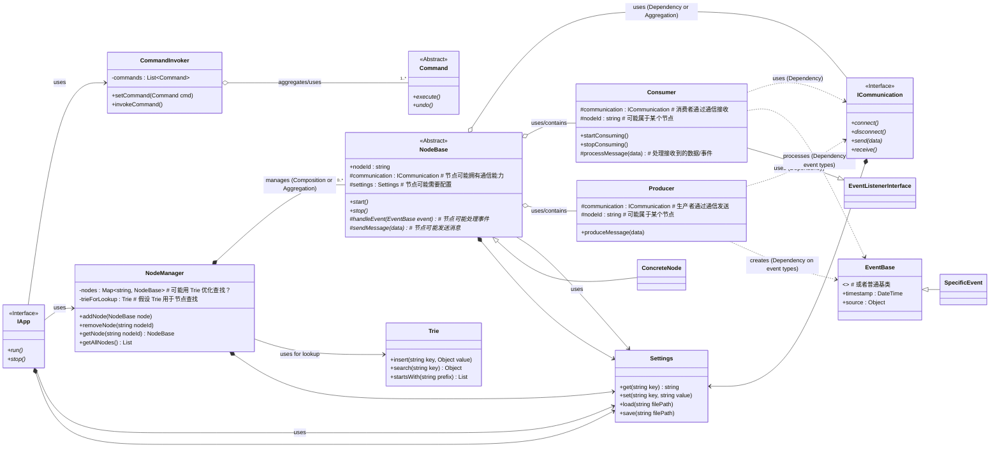

# 核心接口介绍

```mermaid
classDiagram
    direction LR

    class IApp {
        <<Interface>>
        +run()*
        +stop()*
    }

    class CommandInvoker {
        -commands : List~Command~
        +setCommand(Command cmd)
        +invokeCommand()
    }

    class Command {
        <<Abstract>>
        +execute()*
        +undo()*
    }

    class ICommunication {
        <<Interface>>
        +connect()*
        +disconnect()*
        +send(data)*
        +receive()*
    }

    class EventBase {
        <<Abstract>> # 或者普通基类
        +timestamp : DateTime
        +source : Object
    }

    class NodeManager {
        -nodes : Map~string, NodeBase~ # 可能用 Trie 优化查找？
        -trieForLookup : Trie # 假设 Trie 用于节点查找
        +addNode(NodeBase node)
        +removeNode(string nodeId)
        +getNode(string nodeId) NodeBase
        +getAllNodes() List
    }

    class NodeBase {
        <<Abstract>>
        +nodeId : string
        #communication : ICommunication # 节点可能拥有通信能力
        #settings : Settings # 节点可能需要配置
        +start()*
        +stop()*
        #handleEvent(EventBase event)* # 节点可能处理事件
        #sendMessage(data)* # 节点可能发送消息
    }

    class Consumer {
        #communication : ICommunication # 消费者通过通信接收
        #nodeId : string # 可能属于某个节点
        +startConsuming()
        +stopConsuming()
        #processMessage(data) # 处理接收到的数据/事件
    }

    class Producer {
        #communication : ICommunication # 生产者通过通信发送
        #nodeId : string # 可能属于某个节点
        +produceMessage(data)
    }

    class Settings {
        +get(string key) string
        +set(string key, string value)
        +load(string filePath)
        +save(string filePath)
    }

    class Trie {
        +insert(string key, Object value)
        +search(string key) Object
        +startsWith(string prefix) List
    }


    IApp --> CommandInvoker : uses
    IApp --> NodeManager : uses
    IApp --> Settings : uses

    CommandInvoker o-- "1..*" Command : aggregates/uses

    NodeManager *-- "0..*" NodeBase : manages (Composition or Aggregation)
    NodeManager --> Trie : uses for lookup

    NodeBase o-- ICommunication : uses (Dependency or Aggregation)
    NodeBase o-- Consumer : uses/contains
    NodeBase o-- Producer : uses/contains
    NodeBase --> Settings : uses
    NodeBase <|-- ConcreteNode

    Consumer ..> ICommunication : uses (Dependency)
    Producer ..> ICommunication : uses (Dependency)
    Consumer ..> EventBase : processes (Dependency on event types)
    Producer ..> EventBase : creates (Dependency on event types)

    Settings <--* IApp
    Settings <--* NodeManager
    Settings <--* NodeBase
    Settings <--* ICommunication

    Consumer --|> EventListenerInterface
    EventBase <|-- SpecificEvent
```