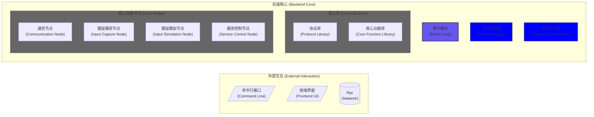

# 1. 引言 (Introduction)
无界
目的： 键鼠跨设备共享软件。
受众： 开发用文档。
范围： 架构设计、核心组件、主要工作流程
# 2. 架构概览 (Architecture Overview)
核心理念： 该软件主要基于事件驱动。需要命令模块支持前后端分离。
高层组件图：

# 3. 核心组件详解 (Core Components Deep Dive)
[IApp](./modules/Base/IApp.md)

CommandInvoker
职责: 触发命令执行，解耦命令发送者和接收者。
关键属性/方法: setCommand, invokeCommand，可能还有命令队列、历史记录等。
关系: 持有并调用 Command 对象。被 IApp 或其他需要执行命令的组件使用。
你需要填充: 命令是如何注册到 Invoker 的？是单个命令还是队列？是否支持撤销(undo)？
Command
职责: 封装一个操作请求。定义执行接口。
关键属性/方法: execute(), 可能有 undo()。
关系: 被 CommandInvoker 调用。通常会有多个具体的子类（例如 CreateNodeCommand, SendMessageCommand）。
你需要填充: 这是接口还是抽象类？execute 方法的典型签名是什么？举例说明一两个具体的 Command 子类及其作用。
ICommunication
职责: 定义通信协议的抽象接口。
关键属性/方法: connect, disconnect, send, receive。
关系: 被需要进行数据交换的类（如 NodeBase, Consumer, Producer）使用。
你需要填充: 支持哪些类型的通信？（TCP/IP, UDP, REST API, Message Queue?）列出具体的实现类（例如 TcpCommunication, RestApiClient）。这些实现类如何配置（可能通过 Settings）？
EventBase
职责: 作为系统中所有事件的基类，提供通用属性。
关键属性/方法: timestamp, source, eventType 等。
关系: 被 Producer 创建，被 Consumer 处理。
你需要填充: 这是抽象类还是普通基类？有哪些通用的事件属性？举例说明几个具体的 Event 子类（例如 NodeStartedEvent, MessageReceivedEvent）。
NodeManager
职责: 发现、注册、跟踪和管理系统中的 NodeBase 实例。
关键属性/方法: addNode, removeNode, getNode, getAllNodes。
关系: 管理 NodeBase 对象集合。可能使用 Trie 进行高效查找。被 IApp 或其他需要节点信息的组件使用。
你需要填充: 节点是如何被发现或注册的？节点的标识符是什么（nodeId）？Trie 具体用于什么查找？（按 ID 前缀？按名称？）
NodeBase
职责: 代表系统中的一个可操作单元或节点。定义节点的通用行为和属性。
关键属性/方法: nodeId, start, stop，可能包含 ICommunication, Consumer, Producer 的引用或实例，以及处理事件/消息的方法。
关系: 被 NodeManager 管理。使用 ICommunication 进行通信，通过 Consumer/Producer 收发消息/事件。可能依赖 Settings。
你需要填充: 这是抽象类吗？有哪些具体的 Node 子类（例如 WorkerNode, MasterNode）？节点的主要生命周期和职责是什么？它如何与 Consumer/Producer 交互？
Consumer
职责: 监听并处理来自 ICommunication 的传入数据或 EventBase 事件。
关键属性/方法: startConsuming, stopConsuming, processMessage。
关系: 通常依赖 ICommunication 来接收数据。处理的数据可能是 EventBase 的子类。可能被 NodeBase 包含或使用。
你需要填充: Consumer 是如何启动和停止的？它监听哪个通信端点或事件总线？processMessage 的逻辑是怎样的（例如，反序列化、路由到处理程序、更新状态）？
Producer
职责: 创建并发送数据或 EventBase 事件到 ICommunication。
关键属性/方法: produceMessage。
关系: 通常依赖 ICommunication 来发送数据。产生的数据可能是 EventBase 的子类。可能被 NodeBase 或其他需要发送消息的组件使用。
你需要填充: 何时以及如何调用 produceMessage？消息/事件是如何构建和序列化的？发送到哪个目标？
Settings
职责: 提供对应用程序配置参数的访问。
关键属性/方法: get, set, load, save。
关系: 被几乎所有需要配置的组件依赖（IApp, NodeManager, NodeBase, ICommunication 的实现等）。
你需要填充: 配置文件格式是什么（JSON, YAML, INI, Properties）？配置是如何加载的（从文件、环境变量、数据库）？有哪些关键的配置项？
Trie
职责: 提供高效的前缀查找功能。
关键属性/方法: insert, search, startsWith。
关系: 被需要这种特定查找功能的类使用（在我们的假设中是 NodeManager）。
你需要填充: 明确说明 Trie 在你的软件中究竟用于什么目的？（例如：通过节点 ID 前缀快速查找节点？实现命令自动补全？）存储的值是什么类型？
# 4. 主要工作流程 (Key Workflows)
说明： 选择几个典型的场景，描述它们是如何通过组件协作完成的。这有助于理解组件如何交互。
示例场景：
应用程序启动流程： IApp.run() -> 初始化 Settings -> 初始化 NodeManager -> 初始化 CommandInvoker -> ... -> 启动节点/服务。
执行一个命令： 用户输入 -> SomeUI -> IApp -> CommandInvoker.setCommand(new MyCommand(...)) -> CommandInvoker.invokeCommand() -> MyCommand.execute() -> (可能调用 NodeManager 或 NodeBase 的方法)。
节点间通信/事件处理： NodeA (Producer) -> produceMessage(MyEvent) -> ICommunication.send(...) -> 网络 -> NodeB (ICommunication) -> receive() -> NodeB (Consumer) -> processMessage(MyEvent) -> NodeB 状态改变或触发其他操作。
填充指南: 为每个选定的工作流程：
简述场景。
使用文字或简单的序列图（也可以用 Mermaid 的 sequenceDiagram）描述涉及的主要类和方法调用顺序。
# 5. 配置 (Configuration)
说明: 详细解释如何配置你的软件。
填充指南:
配置文件的位置和格式。
关键配置项列表及其含义和默认值（引用 Settings 类）。
如何通过环境变量或其他方式覆盖配置。
# 6. 如何构建和运行 (Build and Run - 可选)
说明: 如果文档面向开发者，提供构建和运行指令。
填充指南:
依赖项。
构建步骤。
运行命令。
# 7. API 参考 (API Reference - 可选)
说明: 可以链接到自动生成的 API 文档（如 Doxygen, Javadoc, Sphinx 等）。
下一步行动：
验证和调整 Mermaid 图： 仔细检查我提供的 Mermaid 代码，根据你软件的实际类关系进行修改。添加/删除关系，更改关系类型（依赖、聚合、组合、继承、实现），修正方法和属性。
填充大纲内容： 按照上面的指南，为每个部分和每个类填充具体、准确的信息。重点是清晰地描述每个组件的职责和交互方式。
举例说明： 在描述类和工作流程时，尽可能使用具体的例子，这会让文档更容易理解。